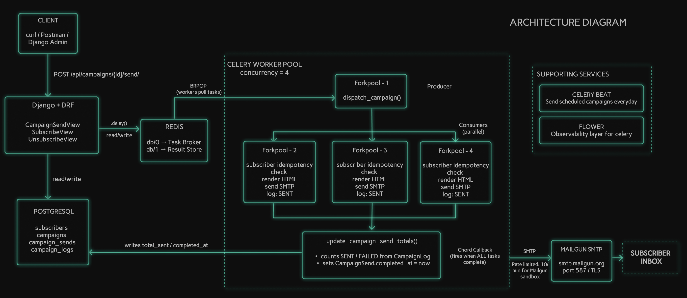
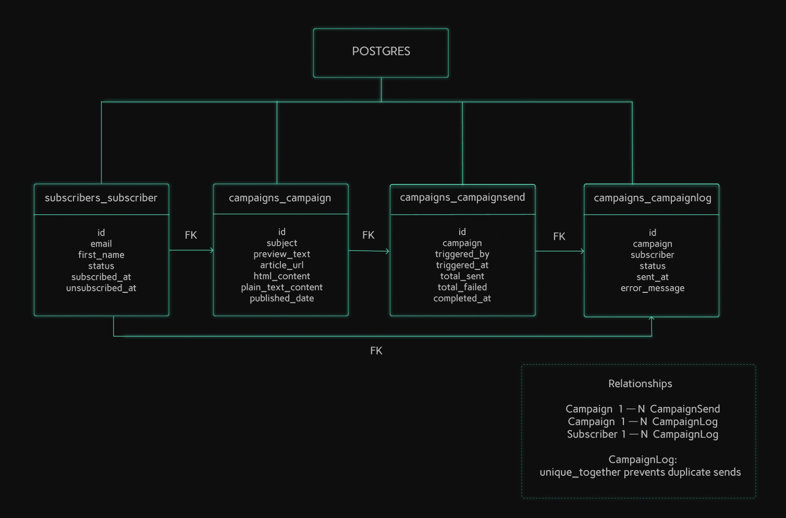

# Django Email Campaign Manager

A production-ready bulk email dispatch system built with Django, Celery, and Redis. Supports subscriber management, campaign creation, and parallelised email delivery via a producer-consumer architecture.

---

## Table of Contents

1. [Overview](#1-overview)
2. [Architecture](#2-architecture)
3. [How Parallelism Works](#3-how-parallelism-works)
4. [Models Schema](#4-models-schema)
5. [API Reference](#5-api-reference)
6. [Screenshots](#6-screenshots)
7. [Prerequisites and Quickstart](#7-prerequisites-and-quickstart)
8. [Design Decisions and Tradeoffs](#8-design-decisions-and-tradeoffs)
9. [How to Scale](#9-how-to-scale)

---

## 1. Overview

A Django based Email Campaign Manager system that allows you to:

- Add and manage email subscribers via REST API and Django Admin
- Create campaigns with rich HTML content, preview text, and article links
- Dispatch campaigns to all active subscribers in parallel using Celery workers and Redis
- Automatically send daily campaigns via Celery Beat scheduling
- Track per-subscriber delivery status, retries, and failures via a campaign log

**Tech Stack**

| Layer | Technology |
|---|---|
| Framework | Django 4.2 + Django REST Framework |
| Database | PostgreSQL |
| Message Broker | Redis |
| Task Queue | Celery 5.3 |
| Scheduler | Celery Beat + django-celery-beat |
| Email | Mailgun SMTP |
| Monitoring | Flower |
| Containerisation | Docker Compose |

---

## 2. Architecture




## 3. How Parallelism Works

### The Problem with Sequential Sending

Sending emails one by one means 1,000 subscribers = 1,000 sequential SMTP calls. At 100ms per call that is 100 seconds of blocking work which is completely unacceptable for a production system.

### The Solution — Producer-Consumer with Celery + Redis

When a campaign send is triggered the system does the following:

1. **Snapshots** all active subscriber IDs at that exact moment
2. **Bulk creates** a `CampaignLog` row per subscriber with `status=pending` in a single DB call
3. **Returns HTTP 202 immediately** , Django does not wait for any emails to send
4. **Publishes** one Celery task per subscriber onto the Redis queue simultaneously
5. **Multiple workers** consume from the queue in parallel, each handling its own SMTP connection independently
6. A **Celery chord callback** fires once every task completes, updating `total_sent`, `total_failed`, and `completed_at`

### Performance Comparison

| Approach | 1,000 subscribers | Crash safe | Retryable |
|---|---|---|---|
| Sequential loop | ~100 seconds | No | No |
| Python threading | ~25 seconds | No | No |
| Celery + Redis | ~10 seconds | Yes | Yes |

### Idempotency

Each worker task checks `CampaignLog.status` before sending. If the row is already `sent` the task skips it and returns immediately. This means tasks are safe to retry , no subscriber ever receives the same campaign twice. The `unique_together = ('campaign', 'subscriber')` constraint on `CampaignLog` provides a second layer of protection at the database level.

### Daily Scheduling via Celery Beat

Celery Beat runs a cron job at `CAMPAIGN_SEND_HOUR` (default 8 AM UTC) that automatically:
- Finds all campaigns where `published_date <= today`
- Skips any campaign that already has a completed send today
- Skips if no active subscribers exist
- Triggers `dispatch_campaign` for each eligible campaign

This means campaigns dispatch automatically every day without any manual intervention.

---

## 4. Models Schema

> The image below shows models schema of the databse tables in the project.



[View full field reference → docs/models-schema.md](docs/models-schema.md)

---

## 5. API Reference

| Method | Endpoint | Description | Response Docs |
|---|---|---|---|
| `POST` | `/api/subscribers/` | Add or resubscribe a user | [docs](docs/api/subscribers.md) |
| `POST` | `/api/subscribers/unsubscribe/` | Unsubscribe a user | [docs](docs/api/subscribers.md) |
| `POST` | `/api/campaigns/{id}/send/` | Trigger campaign dispatch | [docs](docs/api/campaigns.md) |
| `GET` | `/api/campaigns/` | List all campaigns | [docs](docs/api/campaigns.md) |

### Response Code Summary

| Code | Meaning |
|---|---|
| `201` | Subscriber created successfully |
| `202` | Campaign send accepted , tasks firing asynchronously |
| `200` | Re-subscribed or unsubscribed successfully |
| `400` | Validation error , see response body for details |
| `404` | Resource not found |
| `409` | Campaign already sent today |

---

## 6. Screenshots

| What | File |
|---|---|
| Django Admin — campaign logs, all sent | [view](docs/screenshots/Admin.png) |
| pgAdmin — campaign logs query | [view](docs/screenshots/Campaign-logs.png) |
| pgAdmin — campaign send totals | [view](docs/screenshots/Campaign-send.png) |
| Flower — all tasks SUCCESS, parallel execution | [view](docs/screenshots/Celery-tasks.png) |
| Flower — worker online, 0 failures | [view](docs/screenshots/Celery-workers.png) |
| pgAdmin — subscriber table | [view](docs/screenshots/Subscribers.png) |
| Coverage report — 91% | [view](docs/screenshots/Tests.png) |
| Email received — rendered template top | [view](docs/screenshots/mail-1.png) |
| Email received — CTA and unsubscribe footer | [view](docs/screenshots/mail-2.png) |

---

## 7. Prerequisites and Quickstart

### Prerequisites

- Python 3.11+
- PostgreSQL 14+
- Redis 7+
- Docker + Docker Compose (for Option A)

---

### Option A — Docker Compose (recommended, single command)

```bash
# 1. Clone the repo
git clone https://github.com/srishhhhx/campaign-manager.git
cd campaign-manager

# 2. Configure environment
cp .env.example .env
# Add your Mailgun credentials to .env
# Everything else works out of the box

# 3. Single command — starts all 5 services
docker compose up --build
```

On first boot this automatically:
- Runs all migrations
- Creates 10 demo subscribers
- Creates 1 sample campaign
- Creates superuser: `admin` / `admin123`

Services started: `db`, `redis`, `django`, `celery_worker`, `celery_beat`

---

### Option B — Local (without Docker)

```bash
# 1. Clone and create virtual environment
git clone https://github.com/srishhhhx/campaign-manager.git
cd campaign-manager
python -m venv venv
source venv/bin/activate
pip install -r requirements.txt

# 2. Configure environment
cp .env.example .env
# Edit .env — set DB_USER, DB_NAME, REDIS_URL, email credentials

# 3. Database setup
createdb email_campaign
python manage.py migrate
python manage.py createsuperuser
python scripts/seed_test_data.py

# 4. Start all services — open 4 terminals
python manage.py runserver                               # Terminal 1
celery -A core worker --loglevel=info --concurrency=4    # Terminal 2
celery -A core beat --loglevel=info                      # Terminal 3
celery -A core flower --port=5555                        # Terminal 4
```

---

### Monitoring

| Tool | URL | Purpose |
|---|---|---|
| Django Admin | `localhost:8000/admin` | Manage subscribers, campaigns, trigger sends |
| Flower | `localhost:5555` | Monitor Celery tasks and workers in real time |

---

### Trigger a Send

```bash
curl -s -X POST http://localhost:8000/api/campaigns/1/send/ | python3 -m json.tool
```

Expected immediate response — tasks fire asynchronously in the background:

```json
{
    "message": "Campaign send started for 10 subscriber(s).",
    "campaign_send": {
        "id": 1,
        "campaign": 1,
        "triggered_by": "manual",
        "triggered_at": "2026-03-01T13:31:02.221065Z",
        "total_sent": 0,
        "total_failed": 0,
        "completed_at": null
    }
}
```

`total_sent` starts at 0 and updates asynchronously once the chord callback fires. Watch Flower at `localhost:5555` to see tasks complete in parallel.

---

### Tests

```bash
# Run full test suite with coverage
coverage run -m pytest -v
coverage html
open docs/coverage/index.html
```

**Results:**

```
subscribers/tests/test_models.py::test_subscriber_created_with_active_status PASSED
subscribers/tests/test_models.py::test_subscriber_email_unique PASSED
subscribers/tests/test_views.py::test_subscribe_success PASSED
subscribers/tests/test_views.py::test_subscribe_duplicate_active PASSED
subscribers/tests/test_views.py::test_subscribe_reactivates_inactive PASSED
subscribers/tests/test_views.py::test_unsubscribe_success PASSED
subscribers/tests/test_views.py::test_unsubscribe_already_inactive PASSED
campaigns/tests/test_views.py::test_send_success_returns_202 PASSED
campaigns/tests/test_views.py::test_send_duplicate_same_day PASSED
campaigns/tests/test_tasks.py::DispatchCampaignTaskTests::test_dispatch_campaign_sends_to_all_active_subscribers PASSED
campaigns/tests/test_tasks.py::SendEmailTaskTests::test_send_email_task_idempotency PASSED
...

75 passed in 2.56s
```

| App | Tests | Coverage |
|---|---|---|
| `subscribers` | 28 | 96% |
| `campaigns` | 47 | 98% |
| **Total** | **75** | **91%** |

Coverage report — [view](docs/screenshots/Tests.png)

> `campaigns/admin.py` is at 46% — Django admin actions require browser-level Selenium testing which is outside the scope of this test suite.

**Manual test results** — [docs/tests/manual_test_results.md](docs/tests/manual_test_results.md)

**Edge cases tested** — [docs/tests/edge_cases.md](docs/tests/edge_cases.md)

---

## 8. Design Decisions and Tradeoffs

### Celery + Redis over Python Threading

Python threading was considered and rejected for three reasons. Threads share memory a process crash loses all queued jobs with no recovery path. The GIL limits true parallelism for concurrent work. There is no visibility into queue state, failure counts, or retry logic. Redis as a broker gives persistence, Flower observability, built-in retries, and horizontal scalability with no meaningful added complexity.

### Subscriber Snapshot at Trigger Time

Active subscribers are snapshotted immediately when a send is triggered and stored as `CampaignLog` rows with `status=pending`. This is a deliberate design decision. A subscriber who unsubscribes mid-send is handled correctly their task detects the inactive status and marks the log `skipped`. There are no race conditions between the view and the workers because the list is fixed at trigger time, not queried dynamically during execution.

### CampaignLog as Source of Truth

Every send result is written directly to `CampaignLog` rather than relying on Celery's result backend. This gives a permanent per-subscriber audit trail, safe retries via the idempotency check, and the `unique_together` constraint as a database level safety net. Even if a worker crashes and retries, it cannot double-send to a subscriber whose log is already `sent`.

### Chord for Completion Tracking

A Celery `chord` ensures the `update_campaign_send_totals` callback fires exactly once after every individual send task has completed. This keeps `CampaignSend.total_sent` accurate without polling, without race conditions, and without any manual coordination between workers.

### Date-Based 409 Guard

The duplicate send guard blocks any second trigger for the same campaign on the same calendar day regardless of whether the previous send completed. This allows the same campaign to be re-sent the next day valid for a daily newsletter while preventing accidental double-sends within a single day. An in-progress-only check was tried and rejected because it reset once `completed_at` was populated.

### Single Beat Instance

Celery Beat must run as exactly one instance. Multiple Beat processes would fire `send_scheduled_campaigns` multiple times, dispatching the same campaign to every subscriber repeatedly. Docker Compose enforces this with exactly one `celery_beat` service.

---

## 9. How to Scale

The current architecture handles hundreds of subscribers cleanly. Here is the path at larger scale.

### Current Bottlenecks

| Bottleneck | Appears At | Symptom |
|---|---|---|
| Redis memory | 100k+ tasks queued simultaneously | OOM errors on the broker |
| DB write pressure | 100k+ concurrent CampaignLog updates | Table locks, slow writes |
| SMTP rate limits | 500+ emails/min | Delivery failures, blacklisting |
| DB connections | 20+ Celery workers | PostgreSQL connection exhaustion |

### Optimisation Path

**1. Batch Processing — highest impact, lowest effort**

Replace 1-task-per-subscriber with 1-task-per-batch-of-500. Only `campaigns/tasks.py` changes — no model, endpoint, or infrastructure changes:

```
Current:  100,000 individual tasks -> Redis memory spikes
Batched:  200 batch tasks (500 each) -> Redis stays lean

Result:
  Redis memory  -500x
  DB writes     -500x
  Queue depth   -500x
```

**2. PgBouncer Connection Pooling**

Add PgBouncer as a new Docker service between Django/Celery and PostgreSQL. Multiplexes 80+ application connections down to ~10 real DB connections. No application code changes , only a new service in `docker-compose.yml` and a `DB_HOST` update in `.env`.

**3. AWS SES over Mailgun**

| Provider | Per 1,000 emails | Notes |
|---|---|---|
| Mailgun | $0.80 | Good for low volume |
| AWS SES | $0.10 | 8x cheaper at scale |

No code changes. Swap SMTP credentials in `.env`.

**4. Horizontal Worker Scaling**

```yaml
# docker-compose.yml
celery_worker:
  deploy:
    replicas: 8
```

Workers compete for tasks from the same Redis queue. No code changes. Linear throughput scaling.

### Production Cost Estimate

| Scale | Subscribers | Daily emails | Est. Monthly |
|---|---|---|---|
| Small | 1,000 | 1,000 | ~$20 |
| Medium | 50,000 | 50,000 | ~$150 |
| Large | 500,000 | 500,000 | ~$800 |

---

## Environment Variables

See [`.env.example`](.env.example) for the complete list.

| Variable | Description | Default |
|---|---|---|
| `SECRET_KEY` | Django secret key | — |
| `DEBUG` | Debug mode | `True` |
| `DB_NAME` | PostgreSQL database name | `email_campaign` |
| `DB_USER` | PostgreSQL username | — |
| `DB_PASSWORD` | PostgreSQL password | — |
| `DB_HOST` | PostgreSQL host | `localhost` |
| `DB_PORT` | PostgreSQL port | `5432` |
| `REDIS_URL` | Redis connection string | `redis://localhost:6379/0` |
| `CELERY_BROKER_URL` | Celery broker URL | `redis://localhost:6379/0` |
| `CELERY_RESULT_BACKEND` | Celery result backend | `redis://localhost:6379/1` |
| `EMAIL_HOST` | SMTP host | `smtp.mailgun.org` |
| `EMAIL_PORT` | SMTP port | `587` |
| `EMAIL_USE_TLS` | Use TLS | `True` |
| `EMAIL_HOST_USER` | SMTP username | — |
| `EMAIL_HOST_PASSWORD` | SMTP password | — |
| `DEFAULT_FROM_EMAIL` | Sender address | — |
| `USE_DUMMY_EMAIL` | Skip real SMTP for development | `True` |
| `CAMPAIGN_SEND_HOUR` | UTC hour for daily Beat schedule | `8` |